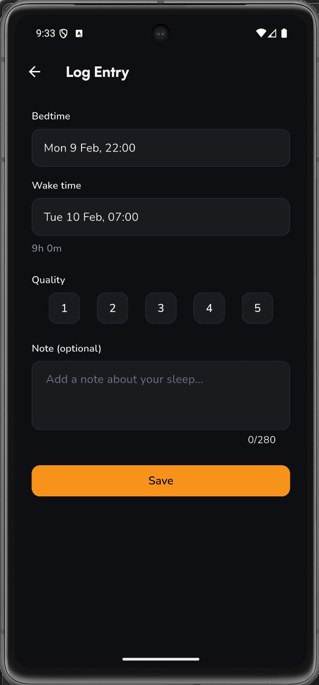
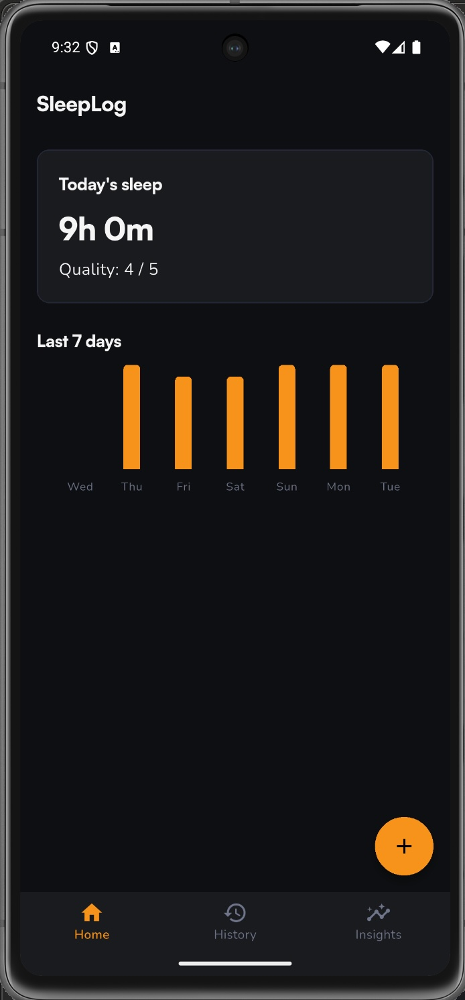
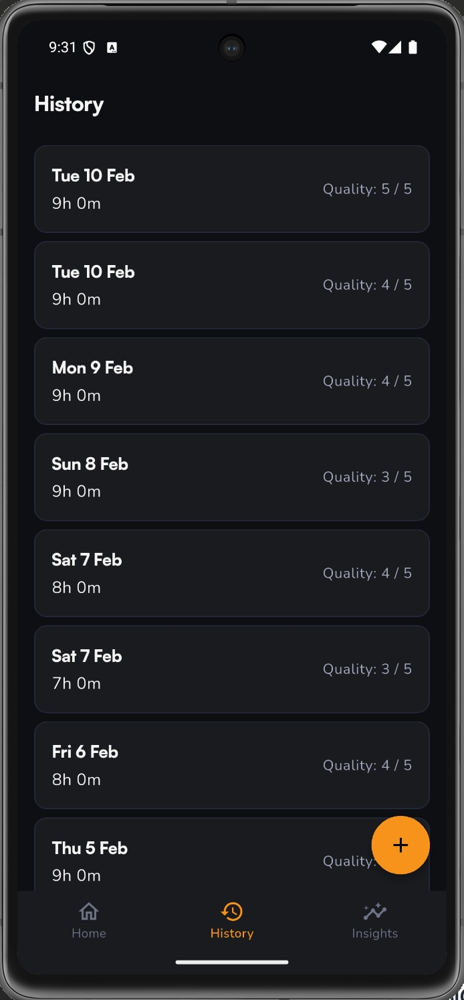
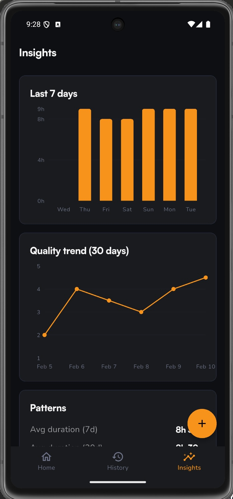

# SleepLog Delivery Overview (D0-D5)

This document summarizes what was delivered in each PRD deliverable milestone using:
- `docs/PRD.md`
- branch history and milestone commits in this repo.

## Branch and Milestone Map

| Deliverable | Branch | Summary |
|---|---|---|
| D0 | [`001-flutter-scaffold-nav`](https://github.com/evalincius/odd-sleep-tracker-mob-app/compare/001-flutter-scaffold-nav) | Flutter scaffold, go_router navigation, Riverpod bootstrap, theme, bundled fonts |
| D1 | [`002-local-db-repository`](https://github.com/evalincius/odd-sleep-tracker-mob-app/compare/002-local-db-repository) | Drift SQLite schema, repository CRUD, validation, duration computation |
| D2 | [`003-log-entry-screen`](https://github.com/evalincius/odd-sleep-tracker-mob-app/compare/003-log-entry-screen) | Log Entry screen with create/edit modes, quality selector, time pickers |
| D3 | [`004-home-history-screens`](https://github.com/evalincius/odd-sleep-tracker-mob-app/compare/004-home-history-screens) | Home summary + mini chart, History list with swipe-to-delete and undo |
| D4 | [`005-insights-screen`](https://github.com/evalincius/odd-sleep-tracker-mob-app/compare/005-insights-screen) | 7-day duration bar chart, 30-day quality line chart, pattern summaries |
| D5 | [`006-polish-qa-release`](https://github.com/evalincius/odd-sleep-tracker-mob-app/compare/006-polish-qa-release) | Integration tests, seed data tooling, accessibility, network audit, release checklist |

## D0 — Flutter Scaffold & Navigation

PRD scope: FR-001 navigation map + basic theming.

Delivered in branch `001-flutter-scaffold-nav`:
- App bootstrap (`lib/main.dart`) with Riverpod `ProviderScope`.
- `StatefulShellRoute.indexedStack` bottom navigation with 3 tabs: Home, History, Insights.
- Full-screen push route for Log Entry (`/log?id={entryId}`).
- Router uses factory function `createRouter()` for test isolation.
- Custom dark theme with manual `ColorScheme` construction (`lib/theme/app_theme.dart`).
- Bundled Satoshi (variable) and Nunito (400/600/700) fonts.
- Shell scaffold with bottom navigation bar (`lib/widgets/shell_scaffold.dart`).
- Screen shells for all 4 screens (Home, History, Insights, Log Entry).
- Routing tests (`test/routing/app_router_test.dart`), screen smoke tests.

## D1 — Local Database & Repository Layer

PRD scope: Section 6 data model + FR-002/003/004/006/008.

Delivered in branch `002-local-db-repository`:
- Drift schema:
  - `sleep_entries` table with UUID primary key, timestamps stored as ISO text (`lib/database/tables/sleep_entries.dart`).
  - CHECK constraints: `quality` 1-5, `duration_minutes` 1-1440.
  - Indexes on `wake_date` and `wake_ts`.
- Repository methods on `AppDatabase` (`lib/database/app_database.dart`):
  - `createEntry` — auto-generates UUID, computes `duration_minutes` and `wake_date`.
  - `listEntries` — filtered by date range, ordered by `wakeTs` DESC.
  - `getEntryById`, `updateEntry`, `deleteEntry`.
- Domain model (`lib/models/sleep_entry_model.dart`) with `CreateSleepEntryInput` / `UpdateSleepEntryInput`.
- Database provider (`lib/providers/database_providers.dart`).
- Tests:
  - Duration computation tests (`test/database/duration_computation_test.dart`).
  - Full repository CRUD tests using in-memory SQLite (`test/database/sleep_entry_repository_test.dart`).

## D2 — Log Entry Screen (Create/Edit)

PRD scope: FR-002/003/004/008/012.

Delivered in branch `003-log-entry-screen`:
- Dual-mode Log Entry screen (`lib/screens/log_entry_screen.dart`):
  - **Create mode** (`/log`) — smart defaults: yesterday 22:00 to today 07:00.
  - **Edit mode** (`/log?id={entryId}`) — pre-fills from existing entry.
- DateTime pickers for bedtime and wake time (cross-midnight supported).
- Quality selector widget (1-5 rating chips, `lib/widgets/quality_selector.dart`).
- Optional note field with 280-char limit.
- Live duration display computed from selected times.
- Validation: blocks save when duration <= 0 or > 24 hours.
- Theme extensions for form styling (`lib/theme/app_theme.dart`).
- Provider for entry loading (`lib/providers/log_entry_providers.dart`).
- Tests:
  - Screen tests for create/edit/validation paths (`test/screens/log_entry_screen_test.dart`).
  - Quality selector widget tests (`test/widgets/quality_selector_test.dart`).



## D3 — Home + History Screens

PRD scope: FR-005/006/007/011.

Delivered in branch `004-home-history-screens`:
- **Home screen** (`lib/screens/home_screen.dart`):
  - Today's sleep summary card (duration in `Xh Ym`, quality rating).
  - "Last 7 days" mini duration bar chart (`lib/widgets/mini_duration_chart.dart`).
  - Empty state with CTA when no entries exist.
  - FAB to create new entry.
  - Debug mode: long-press title seeds 90 days of sample data.
- **History screen** (`lib/screens/history_screen.dart`):
  - Virtualized list (`ListView.builder`) of all entries, newest first.
  - Each card shows wake date, duration, quality.
  - Tap to edit (navigates to Log Entry in edit mode).
  - Swipe-to-delete with `Dismissible` + confirmation dialog.
  - Undo via `SnackBar` (5-second window).
  - FAB to create new entry.
- Providers: `todaySummaryProvider`, `recentDurationsProvider`, `allEntriesProvider` (`lib/providers/home_providers.dart`).
- Tests:
  - Home screen tests (`test/screens/home_screen_test.dart`).
  - History screen tests with delete/undo flows (`test/screens/history_screen_test.dart`).
  - Provider unit tests (`test/providers/home_providers_test.dart`).
  - Mini chart widget tests (`test/widgets/mini_duration_chart_test.dart`).





## D4 — Insights Screen (Charts + Summaries)

PRD scope: FR-009/010/011.

Delivered in branch `005-insights-screen`:
- **Insights screen** (`lib/screens/insights_screen.dart`):
  - 7-day duration bar chart (`lib/widgets/duration_bar_chart.dart`) using fl_chart.
  - 30-day quality line chart (`lib/widgets/quality_line_chart.dart`) using fl_chart.
  - Pattern summary cards (`lib/widgets/pattern_summary_card.dart`):
    - Avg duration (7d and 30d).
    - Avg quality (30d).
    - Total nights tracked.
    - Bedtime consistency.
    - Best/worst day.
  - Empty state when no data; insufficient-data warning when < 7 entries.
- Insights calculator service (`lib/services/insights_calculator.dart`) — all aggregation logic.
- Providers (`lib/providers/insights_providers.dart`).
- Tests:
  - Calculator unit tests with edge cases (`test/services/insights_calculator_test.dart`).
  - Provider tests (`test/providers/insights_providers_test.dart`).
  - Screen widget tests (`test/screens/insights_screen_test.dart`).



## D5 — Polish, QA, Release Readiness

PRD scope: NFR-001/003/004/005 + regression pass.

Delivered in branch `006-polish-qa-release`:
- **Integration tests** (`integration_test/`):
  - `journey_log_sleep_test.dart` — first-use log entry journey (J1).
  - `journey_edit_delete_test.dart` — edit/delete/undo journey (J2).
  - Shared test utilities (`app_test_utils.dart`).
- **Seed data tooling** (`lib/dev/seed_data.dart`):
  - `SeedData.generate(db, days)` — populates realistic sample entries for dev/QA.
  - Tests (`test/dev/seed_data_test.dart`).
- **Network audit test** (`test/audit/network_audit_test.dart`):
  - Scans source for HTTP clients, URL patterns, and network-related imports.
  - Verifies NFR-001: no data leaves the device.
- **Accessibility improvements**:
  - Semantic labels on all interactive controls.
  - Chart accessibility descriptions.
- **UI polish**:
  - History screen delete flow refinement with optimistic UI.
  - Chart rendering improvements across all chart widgets.
  - Provider invalidation helper for cross-screen data refresh (`lib/providers/invalidate_providers.dart`).
- **Release checklist** (`docs/release-checklist.md`):
  - Manual QA steps for all 3 key journeys.
  - Airplane-mode verification protocol.
  - Known limitations documented (DST, multiple entries/day).

## Project Structure

```
lib/
├── main.dart
├── routing/
│   └── app_router.dart
├── database/
│   ├── app_database.dart
│   ├── app_database.g.dart
│   └── tables/
│       └── sleep_entries.dart
├── models/
│   └── sleep_entry_model.dart
├── providers/
│   ├── database_providers.dart
│   ├── home_providers.dart
│   ├── insights_providers.dart
│   ├── log_entry_providers.dart
│   └── invalidate_providers.dart
├── screens/
│   ├── home_screen.dart
│   ├── history_screen.dart
│   ├── insights_screen.dart
│   └── log_entry_screen.dart
├── services/
│   └── insights_calculator.dart
├── theme/
│   └── app_theme.dart
├── widgets/
│   ├── shell_scaffold.dart
│   ├── mini_duration_chart.dart
│   ├── duration_bar_chart.dart
│   ├── quality_line_chart.dart
│   ├── pattern_summary_card.dart
│   └── quality_selector.dart
└── dev/
    └── seed_data.dart

test/
├── routing/
│   └── app_router_test.dart
├── database/
│   ├── duration_computation_test.dart
│   └── sleep_entry_repository_test.dart
├── screens/
│   ├── home_screen_test.dart
│   ├── history_screen_test.dart
│   ├── insights_screen_test.dart
│   └── log_entry_screen_test.dart
├── widgets/
│   ├── quality_selector_test.dart
│   └── mini_duration_chart_test.dart
├── providers/
│   ├── home_providers_test.dart
│   └── insights_providers_test.dart
├── services/
│   └── insights_calculator_test.dart
├── dev/
│   └── seed_data_test.dart
└── audit/
    └── network_audit_test.dart

integration_test/
├── app_test_utils.dart
├── journey_log_sleep_test.dart
└── journey_edit_delete_test.dart
```

## Tech Stack

| Layer | Technology |
|---|---|
| Framework | Flutter 3.38+ / Dart 3.10+ |
| Navigation | go_router ^17.1.0 |
| State | flutter_riverpod ^3.2.1 |
| Database | drift ^2.31.0 (SQLite, on-device only) |
| Charts | fl_chart ^1.1.1 |
| Date formatting | intl ^0.20.0 |
| IDs | uuid ^4.0.0 |
| Fonts | Satoshi (variable), Nunito (400/600/700) — bundled assets |

## Change Magnitude Snapshot (Milestone Commits)

| Deliverable | Commit | Files | Insertions | Deletions |
|---|---|---|---|---|
| D0 | `1ff744c` | 31 | 2,262 | 1 |
| D1 | `4ea4751` | 18 | 2,470 | 0 |
| D2 | `fbecfbf` | 17 | 1,864 | 69 |
| D3 | `554a933` | 20 | 2,143 | 139 |
| D4 | `4d78be9` | 18 | 2,527 | 35 |
| D5 | `b610e58` | 29 | 1,774 | 90 |
| **Total** | | **101** | **12,708** | **2** (cumulative vs main) |

## High-Level Outcome

The app progressed linearly from scaffold to full offline v1 across 6 deliverables, each on its own branch merged forward. The final state is a complete, offline-first sleep tracker with:

- **4 screens**: Home (summary + chart), History (list + CRUD), Insights (charts + patterns), Log Entry (create/edit).
- **Full CRUD**: create, read, update, delete with undo support.
- **Data insights**: 7-day and 30-day aggregations with bar/line charts and plain-English summaries.
- **Zero network dependency**: verified by automated audit test.
- **Comprehensive test coverage**: unit tests, widget tests, provider tests, and integration tests for key user journeys.
- **Release-ready**: documented QA checklist, seed data tooling, and known limitations.
