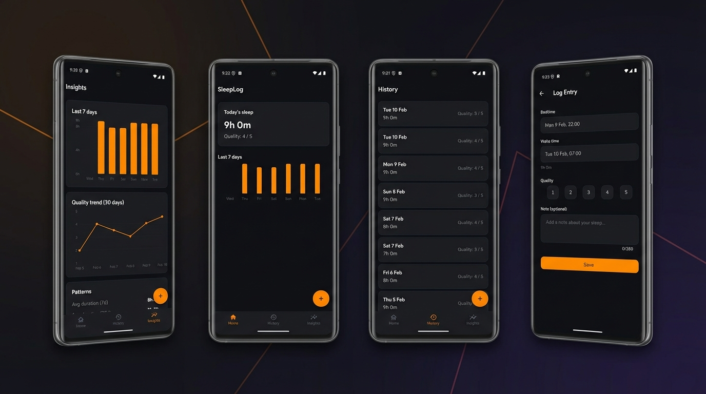

# What You Will Build: SleepLog — A Complete Flutter Mobile App

A hands-on project where you will build a **production-quality, offline-first sleep tracker** from scratch using Flutter, entirely with AI-assisted development (Claude Code + spec-kit workflow).

---

## The App at a Glance

SleepLog will let users track their sleep, review history, and discover patterns — all without accounts, wearables, or cloud services. Every byte of data stays on the device.

 
---

## Tech Stack

| Layer | Technology | Why |
|-------|-----------|-----|
| **Framework** | Flutter 3.38+ / Dart 3.10+ | Cross-platform (iOS + Android) from a single codebase |
| **Navigation** | go_router | Declarative routing with deep link support and bottom nav integration |
| **State Management** | Riverpod | Type-safe, testable, auto-disposing providers |
| **Database** | Drift (SQLite) | Compile-time-safe SQL, code generation, in-memory testing |
| **Charts** | fl_chart | Customisable bar and line charts with Flutter-native rendering |
| **Date Formatting** | intl | Locale-aware date/time display |
| **IDs** | uuid | Collision-free primary keys |
| **Fonts** | Satoshi + Nunito | Bundled custom typography (no runtime downloads) |
| **Backend** | None | Fully offline — zero network calls, verified by automated audit |

---

## Features & Functionality

### 1. Sleep Logging (Create & Edit)
- Log bedtime, wake time, and a 1-5 quality rating
- Cross-midnight sessions handled automatically (e.g., 23:30 to 07:00)
- Optional note field (280-char limit)
- Live duration computation as you pick times
- Input validation blocks impossible entries (duration <= 0 or > 24h)
- Edit any past entry with pre-filled values

### 2. Home Dashboard
- Today's sleep summary card (duration + quality)
- Last 7 days mini bar chart at a glance
- Empty state with call-to-action for first-time users
- Quick access FAB (floating action button) to log new sleep

### 3. History
- Scrollable list of all entries (newest first)
- Tap any entry to edit it
- Swipe-to-delete with confirmation dialog
- Undo via snackbar (5-second window restores the entry)

### 4. Insights & Analytics
- **7-day duration bar chart** — see your recent sleep pattern
- **30-day quality line chart** — track quality trends over time
- **Pattern summary cards** with plain-English insights:
  - Average duration (7-day and 30-day)
  - Average quality (30-day)
  - Bedtime consistency score
  - Best and worst day of the week
  - Total nights tracked

### 5. Developer & QA Tools
- Seed data generator: populate 90 days of realistic sample entries (long-press the Home title)
- Network audit test: automated verification that zero HTTP calls exist in the codebase
- Integration tests covering full user journeys

---

## Architecture Overview

```
┌─────────────────────────────────────────────────┐
│                    Screens                       │
│  Home  │  History  │  Insights  │  Log Entry     │
├─────────────────────────────────────────────────┤
│                   Widgets                        │
│  MiniDurationChart │ DurationBarChart            │
│  QualityLineChart  │ PatternSummaryCard          │
│  QualitySelector   │ ShellScaffold               │
├─────────────────────────────────────────────────┤
│              Riverpod Providers                  │
│  todaySummary │ allEntries │ insightsData        │
│  durationChart │ qualityChart │ patternSummary   │
├─────────────────────────────────────────────────┤
│            Services & Models                     │
│  InsightsCalculator │ SleepEntryModel            │
│  Validation │ Domain Exceptions                  │
├─────────────────────────────────────────────────┤
│            Drift Database (SQLite)               │
│  sleep_entries table │ CRUD repository           │
│  UUID keys │ ISO 8601 timestamps                 │
└─────────────────────────────────────────────────┘
```

---

## Project Structure

```
lib/
├── main.dart                       # App entry point
├── routing/app_router.dart         # go_router config (factory for test isolation)
├── database/
│   ├── app_database.dart           # Drift DB + repository CRUD methods
│   └── tables/sleep_entries.dart   # Table schema with constraints & indexes
├── models/sleep_entry_model.dart   # Domain models + validation
├── providers/
│   ├── database_providers.dart     # DB singleton
│   ├── home_providers.dart         # Today summary + recent durations
│   ├── insights_providers.dart     # Chart + pattern data
│   ├── log_entry_providers.dart    # Entry lookup by ID
│   └── invalidate_providers.dart   # Cross-screen cache refresh
├── screens/
│   ├── home_screen.dart            # Dashboard with summary + mini chart
│   ├── history_screen.dart         # Entry list with swipe-delete + undo
│   ├── insights_screen.dart        # Charts + pattern cards
│   └── log_entry_screen.dart       # Create/edit form with pickers
├── services/insights_calculator.dart  # Pure analytics computation
├── theme/app_theme.dart            # Dark theme, brand colours, typography
├── widgets/                        # Reusable UI components
│   ├── shell_scaffold.dart
│   ├── mini_duration_chart.dart
│   ├── duration_bar_chart.dart
│   ├── quality_line_chart.dart
│   ├── pattern_summary_card.dart
│   └── quality_selector.dart
└── dev/seed_data.dart              # Sample data generator

test/                               # 14 test files — unit, widget, provider tests
integration_test/                   # 2 E2E user journey tests
```

---

## How You Will Build It: 6 Deliverables

You will develop the app incrementally across 6 deliverables, each on its own branch. This mirrors a real-world agile workflow and teaches you how to break a project into manageable units.

| Deliverable | What You Will Build | Key Skills You Will Practise |
|-------------|---------------|---------------------|
| **D0** — Scaffold & Nav | Flutter project, go_router, bottom tabs, theme, fonts | Project setup, routing, theming |
| **D1** — Database | Drift SQLite schema, CRUD repository, validation | ORM setup, code generation, data modelling |
| **D2** — Log Entry Screen | Create/edit form, time pickers, quality selector | Form UX, input validation, cross-midnight logic |
| **D3** — Home + History | Dashboard summary, entry list, swipe-delete, undo | State management, list virtualisation, optimistic UI |
| **D4** — Insights | Bar chart, line chart, pattern analysis | Data aggregation, chart rendering, analytics |
| **D5** — Polish & QA | Integration tests, seed data, accessibility, audit | Testing strategies, QA automation, release prep |

---

## Key Patterns Worth Studying

| Pattern | Where | Why It Matters |
|---------|-------|---------------|
| **Router factory function** | `routing/app_router.dart` | Prevents global state leaks between tests |
| **Provider invalidation** | `providers/invalidate_providers.dart` | Ensures screens refresh after data mutations |
| **Family providers** | `providers/log_entry_providers.dart` | Parameterised data fetching (load entry by ID) |
| **Pure computation service** | `services/insights_calculator.dart` | Testable analytics logic with zero side effects |
| **Domain validation** | `models/sleep_entry_model.dart` | Typed exceptions caught before DB writes |
| **In-memory DB testing** | `test/database/` | Fresh SQLite per test via `NativeDatabase.memory()` |
| **Optimistic UI + undo** | `screens/history_screen.dart` | Delete immediately, restore on undo within 5s |

---

## What's Intentionally Out of Scope

This is a focused v1. The following are deliberately excluded:

- User accounts / authentication / cloud sync
- Wearable integrations (Apple Health, Google Fit)
- Sleep stages, audio recording, smart alarms
- Push notifications or reminders
- Light mode (dark theme only in v1)
- DST-aware timestamp handling (documented limitation)
